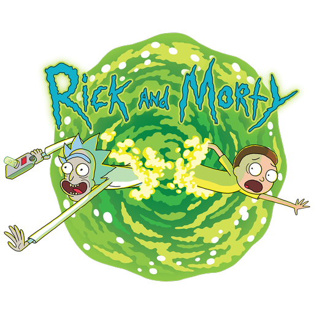

    

# ℹ️ Overview
- Used Flutter with BLoC pattern and Clean architecture to show some information about my favorite series Rick and Morty. 
- Played with some fancy UI widgets.

# 📌 Used API

- Free API : https://rickandmortyapi.com/

# 📱 Screens

